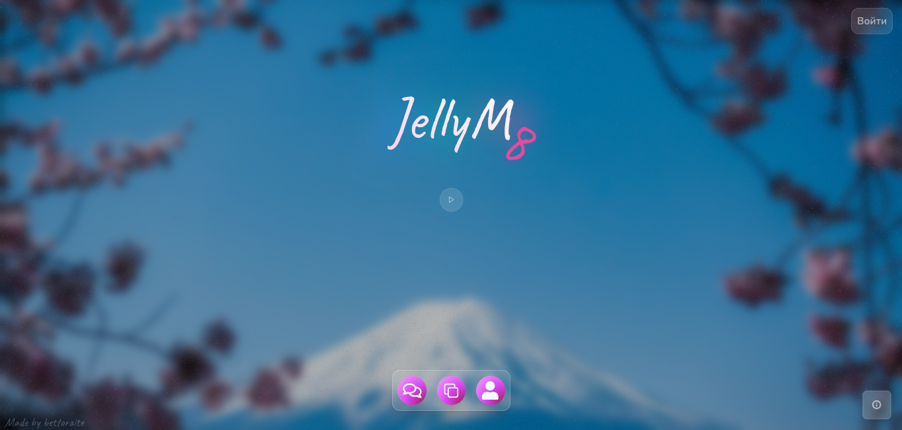
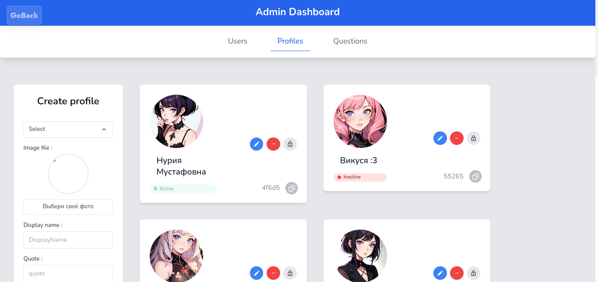
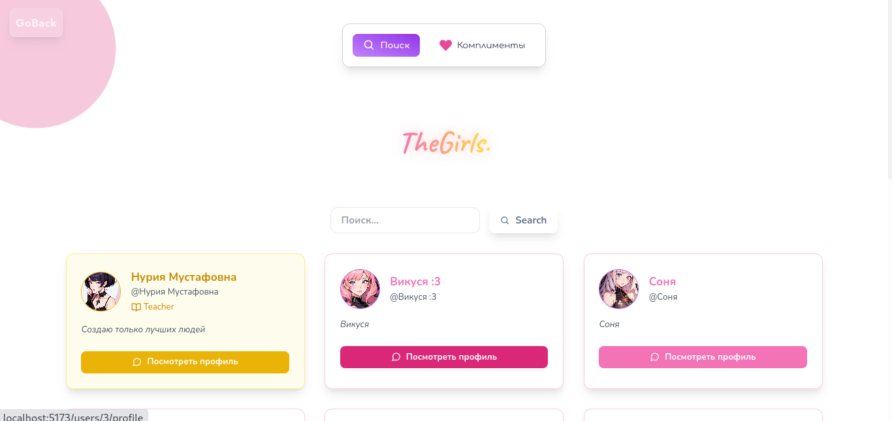
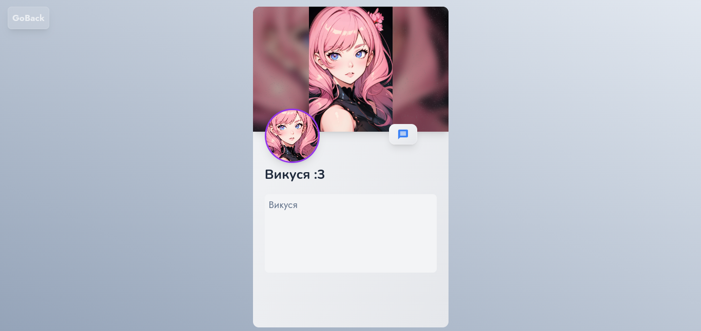
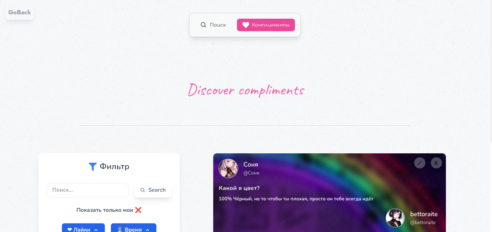
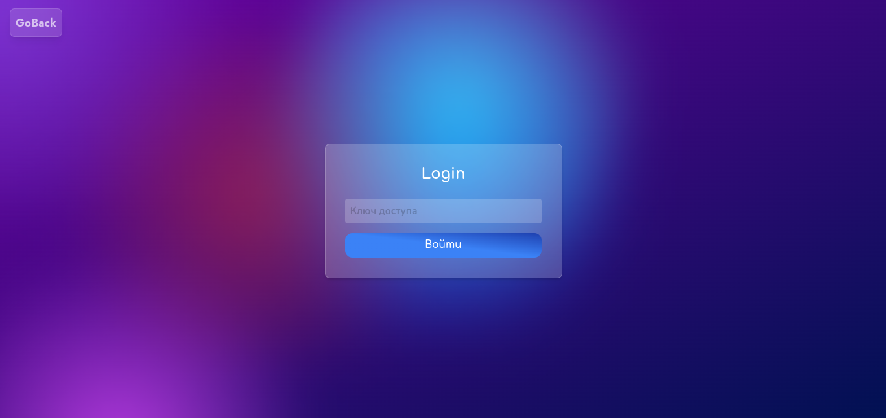

<p align="center">
  
</p>


A modern web application built with cutting-edge technologies to deliver a seamless user experience.
This project features 3D elements, custom authentication, an admin dashboard, user profiles, and smooth animations.

---

## Features

- **3D Interactive Cards**: Built with Three.js for immersive user interactions.
- **Custom Login System**: Secure authentication with secret keys.
- **Admin Dashboard**: Manage users, content, and settings with ease.
- **User Profiles**: Personalized profiles for each user.
- **Search Functionality**: Fast and efficient searching across the platform.
- **Animations**: Smooth and engaging animations powered by Tailwind CSS and Framer Motion.

---

## Technologies Used

- **Frontend**: React, React Router
- **Fetchin, Caching**: React Query
- **3D Rendering**: Three.js
- **Styling**: Tailwind CSS
- **Animations**: Framer Motion
- **Forms**: React Hook Form

# Project screenshoots

## 1. Home Page



## 2. 3D Interactive Cards


## 3. Admin Dashboard


## 4. User Profiles Discovery


## 4. User Profile


## 5. User compliments page


## 6. Login Page



### Installation

Install the dependencies:

```bash
pnpm install
```

### Development

Start the development server with HMR:

```bash
pnpm run dev
```

Your application will be available at `http://localhost:5173`.

## Building for Production

Create a production build:

```bash
pnpm run build
```

### Docker Deployment

To build and run using Docker:

```bash
docker build -t my-app .
# Run the container
docker run -p 3000:3000 my-app
```

### DIY Deployment

If you're familiar with deploying Node applications, the built-in app server is production-ready.

Make sure to deploy the output of `pnpm run build`

```
├── package.json
├── package-lock.json (or pnpm-lock.yaml, or bun.lockb)
├── build/
│   ├── client/    # Static assets
│   └── server/    # Server-side code
```

## Styling

This template comes with [Tailwind CSS](https://tailwindcss.com/) already configured for a simple default starting experience. You can use whatever CSS framework you prefer.

---

Built with ❤️ using React Router.


Attributions:
- "Event Stage with Islamic Elements" (https://skfb.ly/oCUnM) by cryptonx is licensed under CC Attribution-NonCommercial-ShareAlike (http://creativecommons.org/licenses/by-nc-sa/4.0/).
- "Concert Stage" (https://skfb.ly/6Dto7) by Koekphon is licensed under Creative Commons Attribution (http://creativecommons.org/licenses/by/4.0/).
